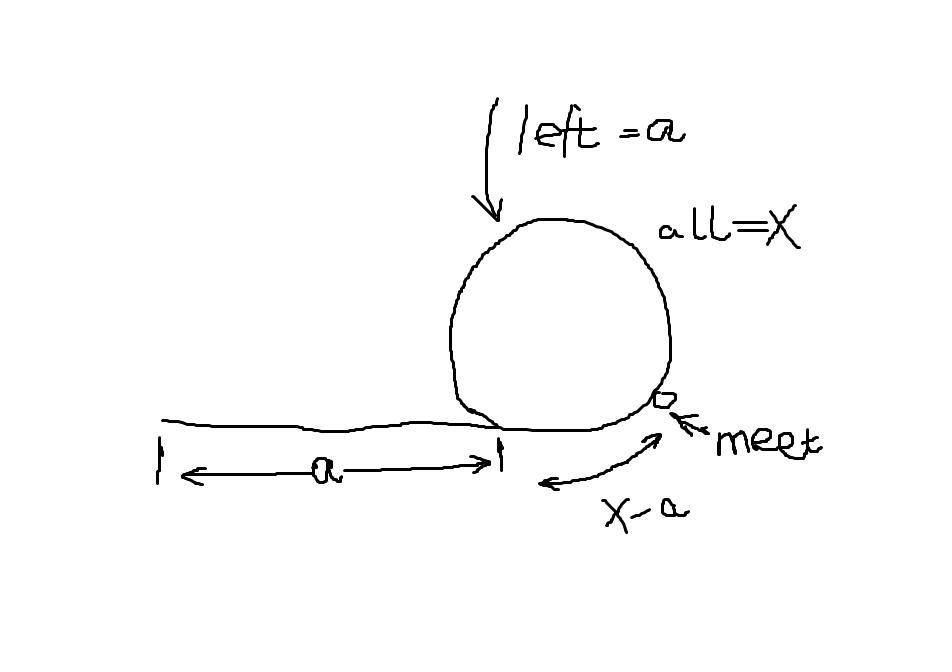

[原题](https://leetcode.com/problems/linked-list-cycle-ii/)


题意：

找到有环的链表的入口。

方法：

首先找到两个指针相遇的地点，然后，重新设置两个指针，一个指向链表的头部，一个指向相交处的位置，然后两个指针移动。

最后两个指针的交点，就是目标的位置。

证明：




设入口的左边长度为a,环的大小为x。

指针1的速度为1，指针2的速度为2
```
1 * t = m * x + a
2 * t = n * x + a
```

m,n分别表示两个人的圈数。


那么交点的位置就是

```
(n - m) * x
```

就是从开始的时候计算的某个长度，这个长度是环的长度的整数倍。

发现，这个倍数无论是多少都无所谓，我们设为1.

那么就能够求出上图的结果，得证。


```
# Definition for singly-linked list.
# class ListNode(object):
#     def __init__(self, x):
#         self.val = x
#         self.next = None

class Solution(object):
    def detectCycle(self, head):
        """
        :type head: ListNode
        :rtype: ListNode
        """
        
        if not head: return None
        p = head
        q = head.next
        while p and q:
            if q.next and q.next.next:
                p = p.next
                q = q.next.next
            else:
                break
            if p is q:
                break
        
        if not p is q: return None
        meet = p
        nummy = ListNode(-1)
        nummy.next = head
        first, second = nummy, meet
        while first != second:
            first = first.next
            second = second.next
        return first
```